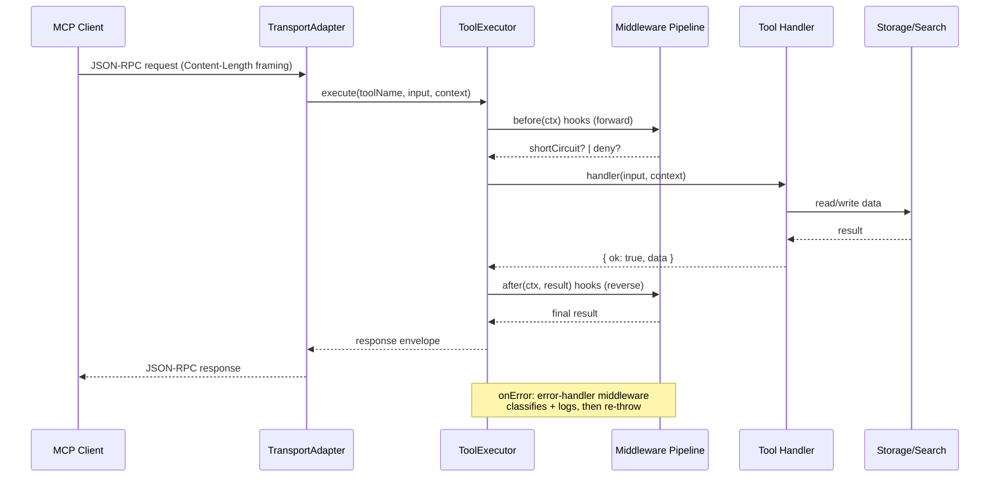
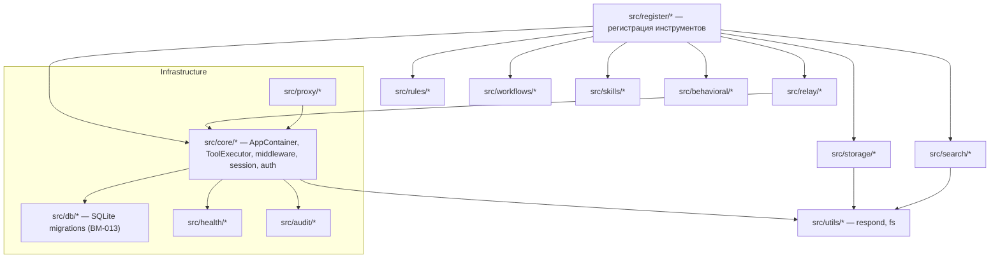

# Architecture

> Mermaid-диаграммы ключевых компонентов (D-005). Обновлять при изменении архитектуры.

## Компоненты и поток данных

```mermaid
flowchart LR
    Client[["MCP Client<br/>(Claude/Cursor/VS Code)"]] -->|stdio / HTTP / TCP / WS| Transport

    subgraph Transport["Transport Layer (src/transport)"]
        Transport[TransportAdapter<br/>stdio · http · stream · relay]
        Registry[TransportRegistry]
    end

    Transport --> AppContainer["AppContainer<br/>(src/core/app-container.ts)<br/>lifecycle: init → start → stop"]
    AppContainer --> Ctx["ServerContext<br/>(src/register/context.ts)"]
    AppContainer --> HC["HealthChecker<br/>app · transport · embeddings · catalog"]

    Ctx --> Executor["ToolExecutor<br/>(src/core/tool-executor.ts)<br/>middleware pipeline + hooks"]
    Executor --> MW["Middleware<br/>ACL · rate-limit · input-sanitize · error-handler"]
    Executor --> Tools["Tool Handlers<br/>(src/register/*.ts)"]

    Tools --> Storage["Storage<br/>tasks · knowledge · prompts"]
    Tools --> Search["Search<br/>BM25 · vector (ONNX)"]
    Tools --> Catalog["Service Catalog<br/>embedded/remote/hybrid"]
    Tools --> Relay["LAN Relay (BM-012)<br/>WS + AES-256-GCM"]
    Tools --> Behavioral["Behavioral Memory<br/>intents · failures · resolutions"]

    Storage --> Files[("Markdown/JSON files<br/>DATA_DIR")]
    Search --> BM25[BM25 index]
    Search --> Vectors[(Vector cache)]

    EventBus["EventBus<br/>(src/core/event-bus.ts)"] -.->|server.started/stopped| AppContainer
    Relay -.->|relay.rule.broadcast| EventBus
```

## Жизненный цикл запроса



## Слои и зависимости



## Ключевые решения

| Решение | Где | Почему |
|---|---|---|
| Middleware pipeline (MW-001) | `src/core/middleware.ts` | onError может только swallow или re-throw оригинал; нормализация — в ErrorHandler (TD-010) |
| Атомарная запись JSON | `src/fs.ts` writeJson | tmp+rename защищает от ENOSPC/крэша (Q-013) |
| ServiceAvailability singleton | `src/core/graceful-degradation.ts` | health-чеки embeddings/catalog видят реальные сбои (AI-009) |
| LAN Relay zero-dep discovery | `src/relay/discovery.ts` | UDP multicast вместо mDNS-библиотеки (BM-012) |
| Type-check тестов | `tsconfig.test.json` | tests/** включены в tsc, моки проверяются satisfies (TD-012, Q-012) |
